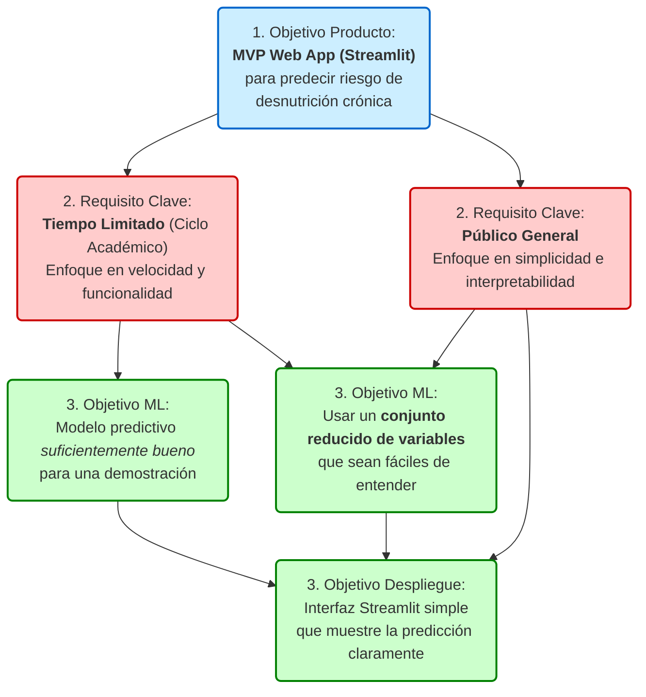
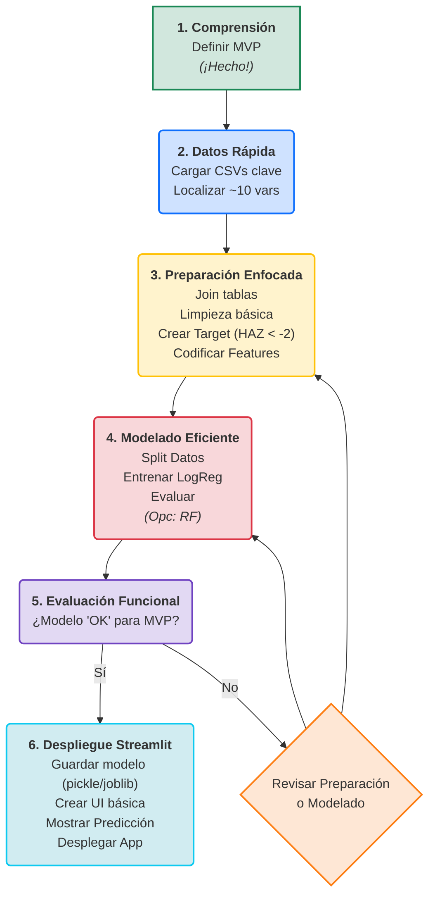

# Fase 1 — Comprensión del Negocio: Proyecto MVP de Predicción de Desnutrición Crónica

## 1. Determinación de Objetivos de Negocio (El "Por Qué")

- **Objetivo Principal:** Desarrollar un Producto Mínimo Viable (MVP) en formato de aplicación web (usando Streamlit) que prediga el riesgo de desnutrición crónica infantil (stunting) en menores de 5 años.
- **Audiencia:** Público general (no académico/científico).
- **Propósito:** Crear una herramienta funcional y educativa que demuestre el uso de Machine Learning para un problema de salud pública, priorizando la rapidez de desarrollo, funcionalidad e interpretabilidad.

### Árbol de Objetivos del MVP

Este diagrama conecta el "Por Qué" (la app) con el "Qué" (el modelo).

## 2. Determinación de Objetivos de Minería de Datos (El "Qué" Técnico)

Este es el "plano" técnico del modelo, basado en el informe de Scopus AI.

### Variable Objetivo (Target)

- **Nombre:** Desnutricion_Cronica (variable que crearemos).
- **Definición:** Será una variable binaria (0 o 1).
- **Cálculo:** Desnutricion_Cronica = 1 si el puntaje Z de Talla para la Edad (HAZ) es < -2.
- **Cálculo:** Desnutricion_Cronica = 0 si el puntaje Z de Talla para la Edad (HAZ) es >= -2.
- **Fuente de HAZ:** Módulo de Antropometría de niños (probablemente REC41.csv).

### Variables Predictoras (Features)

Se seleccionará un conjunto reducido (aprox. 5–10) de predictores fuertes e interpretables, basados en el informe de Scopus AI.

- **Candidatos prioritarios:**
  - Maternos: Nivel educativo, Estatura de la madre.
  - Niño: Edad del niño, Peso al nacer.
  - Hogar: Nivel de riqueza, Saneamiento (tipo de baño), Acceso al agua.
  - Contextual: Zona (Urbano/Rural).

### Modelos a Evaluar (Enfoque MVP)

- **Prioridad 1 (Interpretable):** Regresión Logística o Árbol de Decisión (rápidos de entrenar y fáciles de explicar en Streamlit).
- **Prioridad 2 (Si el tiempo permite):** Random Forest (buen rendimiento y permite ver "Importancia de Características").

