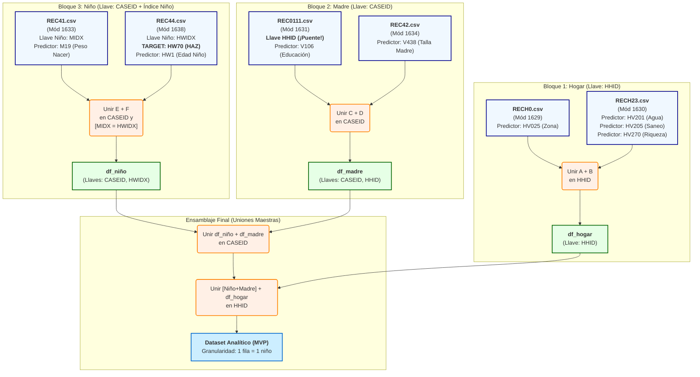

# Fase 2: Comprensión y Selección de Datos

## 1\. Propósito de esta Fase

El objetivo de esta fase fue analizar los 11 módulos de datos crudos (CSV) proporcionados por la ENDES 2024 para identificar y seleccionar el **conjunto mínimo de archivos y variables** necesario para construir el Producto Mínimo Viable (MVP) definido en la Fase 1.

El proceso se guio por dos criterios principales:

1.  **Relevancia (Informe Scopus):** ¿Contiene el archivo los predictores "fuertes" (ej. educación materna, saneamiento, peso al nacer) o la variable objetivo (`HW70`) identificados en la investigación (`Medición de la desnutrición crónica infantil.pdf`)?
2.  **Simplicidad (MVP - Fase 1):** ¿Podemos obtener el dato con un esfuerzo de unión (join) y limpieza razonable para una entrega rápida?

## 2\. Resumen Ejecutivo: El Plan de 6 Archivos ***(CORREGIDO)***

Tras el análisis de los 11 módulos y los diccionarios de datos, hemos seleccionado un plan de **6 archivos clave** que nos da acceso a todos nuestros predictores objetivo.

Este plan de 6 archivos es la arquitectura de datos final para nuestro MVP y representa la forma más eficiente de ensamblar los datos de los 3 niveles jerárquicos (Hogar, Madre y Niño).

### Diagrama de Flujo de Unión (Plan de Fase 3)

Este diagrama representa la arquitectura de datos para nuestro MVP. Muestra cómo los 6 archivos elegidos se ensamblarán para crear el dataset analítico final.

## 3\. Especificación Técnica de Archivos Elegidos

### Lista de Materiales (Bill of Materials) - Plan de 6 Archivos

#### Bloque 1: HOGAR (Llave de unión: `HHID`)

1.  **Archivo:** `RECH0.csv` (Módulo 1629)

      * **Propósito:** Datos de identificación y zona del hogar.
      * **Llave de Unión:** `HHID` (Identificación Cuestionario del Hogar)
      * **Predictor:** `HV025` (Área de residencia)

2.  **Archivo:** `RECH23.csv` (Módulo 1630)

      * **Propósito:** Datos de saneamiento y riqueza del hogar.
      * **Llave de Unión:** `HHID` (Identificación Cuestionario del Hogar)
      * **Predictor:** `HV201` (Fuente principal de agua)
      * **Predictor:** `HV205` (Tipo de servicio higiénico)
      * **Predictor:** `HV270` (Índice de riqueza)

#### Bloque 2: MADRE (Llave de unión: `CASEID`)

3.  **Archivo:** `REC0111.csv` (Módulo 1631)

      * **Propósito:** Datos educativos de la madre. **¡Archivo "Puente"\!**
      * **Llave de Unión (Principal):** `CASEID` (Identificación Cuestionario Individual)
      * **Llave de Unión (Puente):** `HHID` (Para conectar con el Bloque 1: Hogar)
      * **Predictor:** `V106` (Nivel educativo más alto)

4.  **Archivo:** `REC42.csv` (Módulo 1634)

      * **Propósito:** Datos antropométricos de la madre.
      * **Llave de Unión:** `CASEID` (Identificación Cuestionario Individual)
      * **Predictor:** `V438` (Talla de entrevistada)

#### Bloque 3: NIÑO (Llave de unión: `CASEID` + `Índice de Niño`)

5.  **Archivo:** `REC41.csv` (Módulo 1633)

      * **Propósito:** Datos de nacimiento del niño.
      * **Llave de Unión (Madre):** `CASEID` (Identificación Cuestionario Individual)
      * **Llave de Unión (Niño):** `MIDX` (Orden de historia de nacimiento)
      * **Predictor:** `M19` (Peso del niño al nacer en kilos)

6.  **Archivo:** `REC44.csv` (Módulo 1638)

      * **Propósito:** ¡Crítico\! Contiene nuestro objetivo y la edad del niño.
      * **Llave de Unión (Madre):** `CASEID` (Identificación de caso)
      * **Llave de Unión (Niño):** `HWIDX` (Número de orden de la historia del nacimiento)
      * **Predictor:** `HW1` (Edad del Niño en meses)
      * **VARIABLE OBJETIVO (TARGET):** `HW70` (Talla/Edad Desviación Estándar - HAZ)

## 4\. Justificación de Archivos Descartados (Análisis de Brecha)

El siguiente análisis justifica por qué los 5 módulos restantes fueron excluidos, alineados con nuestros objetivos de Fase 1.

### 4.1. Descartados por Complejidad vs. Valor (Potenciales para V2.0)

Estos módulos contienen predictores relevantes (según Scopus), pero añaden una complejidad significativa (más uniones, más limpieza) que se opone a la velocidad del MVP.

  * **`REC43.csv` (Módulo 1634):**
      * *Contenido:* `H11` (Tuvo diarrea).
      * *Decisión:* Es un predictor fuerte, pero añade un 7mo archivo a la unión. Se posterga para una V2.
  * **Módulo 1641 (Programas Sociales):**
      * *Contenido:* `QH95` (Programa JUNTOS), `PS109 1B` (QALIWARMA).
      * *Decisión:* Excelentes predictores, pero `HV270` (Riqueza) del `RECH23` actúa como un "proxy" (un sustituto) más simple y directo para el MVP. Omitido por velocidad.
  * **`REC91.csv` (Mód. 1631):** ***(Línea CORREGIDA)***
      * *Contenido:* Prácticas de alimentación (lactancia, etc.).
      * *Decisión:* Relevante, pero las variables son complejas de procesar y codificar. Omitido por velocidad.

### 4.2. Descartados por Redundancia

  * **`RECH1.csv` (Módulo 1629):**
      * *Contenido:* Mapa de miembros del hogar.
      * *Decisión:* Redundante. Nuestro "Plan de 6 Archivos" une Hogar (`HHID`) y Madre/Niño (`CASEID`) usando el archivo puente `REC0111`, lo cual es más robusto.

### 4.3. Descartados por Irrelevancia (Fuera de Alcance del MVP)

Estos módulos no contienen información sobre nuestro objetivo: **Estado Nutricional (Talla/Edad) en niños medidos**.

  * **`RECH4.pdf`, `RECHM.pdf` (Mód. 1629) y `REC83.pdf` (Mód. 1637):**
      * *Decisión:* Irrelevantes. Tratan sobre mortalidad, no sobre el estado nutricional de los niños *vivos* medidos.
  * **`CSALUD01.pdf` (Módulo 1640):**
      * *Decisión:* Irrelevante. Es sobre la salud de *adultos*.
  * **`CSALUD08.pdf` (Módulo 1640):**
      * *Decisión:* Irrelevante. Es sobre salud bucal y ocular del niño, no antropometría (Talla/Edad).
  * **`REC95.pdf`, `DIT.pdf` (Módulo 1634):**
      * *Decisión:* Irrelevantes. Tratan sobre anemia y desarrollo cognitivo, que están fuera de nuestro alcance (Talla/Edad).

### 4.4. Descartados por Complejidad Psicosocial (Fuera de Alcance del MVP)

  * **Módulos 1635, 1636, 1637, 1639:**
      * *Contenido:* Violencia, VIH, Disciplina, etc. (`RE516171`, `RE758081`, `REC84DV`, `REC93DVdisciplina`).
      * *Decisión:* Aunque son factores importantes en el desarrollo infantil, están fuera del alcance de un MVP rápido enfocado en predictores estructurales, biológicos y socioeconómicos.
